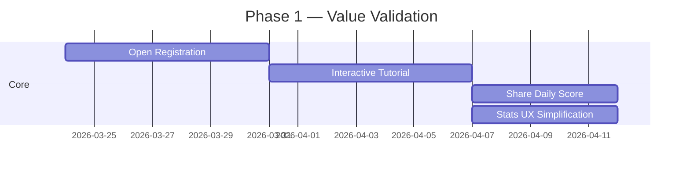

# 🎯 Product Strategy Brief: Aaron's Euchre

**Date:** March 23, 2026
**Status:** CPO Product Audit — V1.79 Codebase Review
**Live Product:** [aarons-euchre.vercel.app](https://aarons-euchre.vercel.app)

---

## 1. Executive Summary

Aaron's Euchre is a surprisingly mature product for its origins — a personal multiplayer Euchre game that has evolved into a full-featured card gaming platform with real-time multiplayer, a sophisticated AI engine with distinct bot personalities, deep analytics, and a Daily Challenge mode. It has a strong technical foundation (React + TypeScript + Supabase + Vite + Framer Motion) and a polished, premium UI.

**The core insight of this audit:** The product has **world-class depth** (bot AI, analytics, event sourcing) but **zero discoverability and zero growth loops**. It is a closed ecosystem for ~6 known users. The path from "functional tool" to "market-leading product" requires **building the connective tissue** that turns a private game into a destination.

> [!IMPORTANT]
> The single biggest risk to this product is not a technical one — it's **audience size**. Everything works, but nobody outside the inner circle knows it exists. Every strategic recommendation below is designed to solve this.

---

## 2. Product Audit: What's Working vs. What's Leaking

### 🟢 High-Value Zones (Strengths to Protect)

| Feature | Why It Works | Product Signal |
|---------|-------------|----------------|
| **Bot AI with Personality Archetypes** | 6 named bots with tunable aggressiveness/risk/consistency. "Next" calling, donation, sandbagging — this is genuinely expert-level Euchre. | **Moat.** No competitor has this depth of bot personality. |
| **Daily Challenge ("Hand of the Day")** | Seeded deterministic hands, global leaderboard, one-play-per-day constraint. | **Retention hook.** This is the Wordle mechanic applied to Euchre. |
| **Real-Time Multiplayer Sync** | Deterministic state via broadcastDispatch. First-human-generates, all-apply pattern is elegant and battle-tested. | **Core infrastructure.** Reliable and well-documented. |
| **Deep Analytics Suite** | Trump call analytics, hand strength tables, bot audit view, per-player stats with 16+ metrics. | **Differentiator.** No casual card game tracks this much data. |
| **Premium Aesthetics** | Glassmorphism, Framer Motion animations, sketchy/hand-drawn visual language. Feels intentional. | **Brand identity.** The aesthetic is unique and memorable. |
| **Game Recap Modal** | Post-game score graph with SVG visualization, MVP/LVP, per-player breakdowns. | **Engagement driver.** Makes every game feel consequential. |

### 🔴 Leakage Points (Where Interest Dies)

| Issue | What Happens | Impact |
|-------|-------------|--------|
| **Hardcoded User Whitelist** | Login is limited to ~8 predefined names (Aaron, Polina, Gray-Gray, Mimi, Micah, Cherrie, TEST). No signup. | **Fatal for growth.** New users literally cannot play. This is a party of 6 with a locked door. |
| **No Onboarding / Tutorial** | New players land on a create/join screen with no explanation of Euchre rules or how to play. | **High bounce rate.** Euchre is a niche game; most people don't know the rules. |
| **No Social / Sharing** | No way to share Daily Challenge scores, game recaps, or invite friends via link. | **Zero virality.** The Daily Challenge is a Wordle-like mechanic with no share button. |
| **Stats Tab Overload** | 9 tabs: Me, League, Daily Challenge, Trump Analytics, Hand Strength, Bot Audit, Freeze Incidents, State Management, Commentary. | **Developer dashboard, not player dashboard.** Most users will never click Bot Audit or Freeze Incidents. |
| **No Push/Pull Notifications** | No way to notify players it's their turn, a friend started a game, or the daily challenge is live. | **Breaks async play.** Users must actively check the app. |
| **Table Code Join UX** | 6-digit code requires out-of-band communication (text the code to a friend). No deep links, no QR codes. | **Friction to multiplayer.** Every extra step loses players. |
| **Commentary Tab is Empty** | Shows "Semantic analysis engine v1.0 offline." | **Broken promise.** An empty tab is worse than no tab. |

---

## 3. Strategic Roadmap

### Phase 1: Value Validation (0–4 weeks)
> *Prove the product's worth to anyone who tries it, not just the inner circle.*



| # | Feature | Rationale | Effort |
|---|---------|-----------|--------|
| 1 | **Open Registration** — Replace the hardcoded whitelist with a simple username + optional Supabase Auth flow. Allow anyone to create an account. | Non-negotiable. You cannot validate product-market fit with 6 users. | Medium |
| 2 | **Interactive Tutorial** — A guided first-game against bots that teaches Euchre basics: follow suit, trump, bowers, bidding. | Euchre's learning curve is the #1 barrier. An in-app tutorial converts curious visitors into engaged players. | Medium |
| 3 | **Share Daily Score** — Generate a shareable image/text (like Wordle's colored grid) after completing the Daily Challenge. Copy-to-clipboard + native share sheet. | This is the **growth engine**. Every shared score is a free ad. The Daily Challenge already has the mechanic; it just needs the share button. | Small |
| 4 | **Stats UX Simplification** — Hide developer tabs (Freeze Incidents, State Management, Commentary, Bot Audit) behind an admin toggle. Show only: My Stats, Leaderboard, Daily Challenge, Trump Analytics. | Reduce cognitive load for non-power users. The current 9-tab view is overwhelming. | Small |

### Phase 2: Differentiators (4–12 weeks)
> *Build capabilities that competitors cannot easily replicate.*

| # | Feature | Why It's a Moat | Effort |
|---|---------|----------------|--------|
| 5 | **"Play Like Huber" Mode** — Let players select a bot personality before a solo game. The game grades you on how closely your decisions matched that bot's algorithm. | No card game does this. It turns your AI engine into a **learning tool** and a **content generator** ("I scored 92% playing like Huber!"). | Large |
| 6 | **Win Probability Engine** — Real-time Monte Carlo simulation showing live win probability during trick play. Display as a subtle bar or percentage next to the scoreboard. | This is the ESPN "win probability graph" for card games. It transforms passive watching into active analysis and creates a highlight-reel effect ("We had a 12% chance and came back!"). Already in your future roadmap as [EUC-008]. | Large |
| 7 | **Invite Links + QR Codes** — Generate a shareable URL (`aarons-euchre.vercel.app/join/123-456`) or QR code to join a table. | Removes the friction of code-sharing. Essential for growing beyond the friend group. | Small |
| 8 | **Seasons & Badges** — Monthly leaderboard resets with season archives and achievement badges (First Loner, 100 Hands, Euchre Master). | Creates recurring engagement. Players come back to "defend" their ranking. Already in your CTO roadmap as Phase 2 #9. | Medium |

### Phase 3: Expansion (12–24 weeks)
> *The long-term vision for market dominance.*

| # | Feature | Vision | Effort |
|---|---------|--------|--------|
| 9 | **Matchmaking Queue** — Click "Find a Game" and get paired with random players at your skill level. ELO/TrueSkill rating. | Transforms from "play with friends" to "play anytime." This is the critical mass feature. | XL |
| 10 | **Spectator Mode + Replay Viewer** — Watch live games or replay finished ones. "Tape Viewer" from event stream. | Creates content creators and a passive engagement mode. Already conceptualized as [EUC-009]. | Large |
| 11 | **Mobile PWA / Native Wrapper** — Full Progressive Web App with push notifications, offline support, and home screen install. | Euchre is a mobile-first game. The responsive design is there; PWA is the bridge. | Medium |
| 12 | **Variant Support** — Stick the Dealer, Canadian Loner, etc. Configurable house rules per table. | Expands addressable market to regional Euchre communities who play with their own rules. | Large |

---

## 4. Opportunity Identification: Three High-Impact Features

> [!TIP]
> These are ideas **not yet in any existing roadmap document** that could materially change the trajectory of the product.

### 🔥 Opportunity 1: "Euchre IQ" — Personalized Skill Rating

**What:** After every game, calculate an "Euchre IQ" score for each player based on the quality of their decisions (not just outcomes). Compare each human decision against the optimal bot move and score accuracy.

**Why:** 
- Euchre has no standardized skill metric. Chess has ELO; Poker has ROI. You can **invent the metric** for Euchre.
- Every hand generates a data point. You already have the bot AI to calculate the "correct" move for comparison.
- Creates a personal improvement loop: "My Euchre IQ went from 72 to 81 this month."

**How:** After each trick, record the human's play and the bot's recommended play. Score: +1 for matching the optimal move, +0.5 for a reasonable alternative, 0 for a blunder. Aggregate across hands into an IQ-like score (scale 50–150).

**Impact:** High retention (players want to improve), high shareability ("My Euchre IQ is 112"), and a completely defensible differentiator — no one else has the bot engine to power this.

---

### 🔥 Opportunity 2: "Table Talk" — Asynchronous Game Mode

**What:** A turn-based mode where players take turns on their own schedule, like Words with Friends. Each player gets a notification when it's their turn.

**Why:**
- Real-time multiplayer requires 4 people online simultaneously. That's a coordination nightmare for casual players.
- The event-sourced architecture already supports restoring game state from any point. The infrastructure is there.
- This unlocks the "play from the bathroom" use case that drives mobile card game engagement.

**How:** When it's a human player's turn and they're not online, send a push notification (if PWA) or email. Set a 24-hour turn timer with bot auto-play if the timer expires.

**Impact:** Dramatically increases the playable surface area. Games no longer require scheduling. This is the single change most likely to increase DAU.

---

### 🔥 Opportunity 3: "The Booth" — AI Commentary & Post-Hand Analysis

**What:** An AI-powered color commentary system that narrates games in real time, like a sports broadcast. After each hand, provide a 2-3 sentence analysis: "Huber made a bold Next call with only 2 trump. It paid off — Aaron had been void in clubs and couldn't stop the march."

**Why:**
- Your "Commentary" tab already exists but is empty ("Semantic analysis engine v1.0 offline"). This fulfills that promise.
- Game commentary transforms a silent card game into a storytelling experience. It makes every hand feel dramatic, even against bots.
- You already have all the data: trump call reasoning, bot decision logs, hand strength, trick results. You just need to synthesize it into natural language.

**How:** After each hand result, construct a template-based or LLM-generated narrative from the event log. Start with template-based ("X called trump with strength Y. The hand ended with Z tricks.") and graduate to LLM-powered narration that captures drama and personality.

**Impact:** Massive engagement boost for solo players. Makes every game feel like a story, not just a score. Creates shareable "highlight plays" for social distribution.

---

## 5. Competitive Landscape & Positioning

| Competitor | Strengths | Weaknesses vs. Aaron's Euchre |
|-----------|-----------|-------------------------------|
| **Trickster Euchre** | Large user base, matchmaking, mobile-first | Generic bots, no analytics, no personality system |
| **World of Card Games** | Browser-based, quick play | Dated UI, no stats tracking, no daily challenge |
| **VIP Euchre** | Social features, clubs | Pay-to-win mechanics, no transparency in bot AI |
| **Euchre 3D** | Polished mobile app | Aggressive ads, basic AI, no multiplayer innovation |

**Aaron's Euchre Positioning Statement:**

> The most intelligent Euchre experience on the internet — with named bots that play like real people, analytics that make you a better player, and a daily challenge that connects you with your friends.

---

## 6. Prioritization Matrix

```
                        HIGH IMPACT
                            │
         ┌──────────────────┼──────────────────┐
         │                  │                  │
         │   Share Daily    │  Open            │
         │   Score          │  Registration    │
         │                  │                  │
         │   Invite Links   │  Euchre IQ       │
LOW      │                  │                  │   HIGH
EFFORT ──┼──────────────────┼──────────────────┼── EFFORT
         │                  │                  │
         │   Stats UX       │  Tutorial        │
         │   Cleanup        │                  │
         │                  │  Table Talk      │
         │                  │  (Async Mode)    │
         │                  │                  │
         └──────────────────┼──────────────────┘
                            │
                        LOW IMPACT
```

**Recommended execution order:**
1. **Open Registration** ← Unlocks everything else
2. **Share Daily Score** ← Immediate growth loop
3. **Invite Links** ← Reduces multiplayer friction
4. **Stats UX Simplification** ← Quick win for polish
5. **Interactive Tutorial** ← Converts new users
6. **Euchre IQ** ← The killer differentiator

---

## 7. Key Metrics to Track

| Metric | Current State | Target (6 months) |
|--------|--------------|-------------------|
| **Registered Users** | 6 (hardcoded) | 500+ |
| **Daily Active Users (DAU)** | Unknown (no analytics) | 50+ |
| **Daily Challenge Completion Rate** | Unknown | 40%+ of DAU |
| **Average Games per User per Week** | Unknown | 3+ |
| **Share Rate (Daily Score)** | 0% (feature doesn't exist) | 15%+ of completions |
| **Multiplayer Game Starts per Day** | Unknown | 10+ |
| **Bounce Rate (new users)** | Unknown | <50% |

> [!WARNING]
> You currently have **zero product analytics**. Before implementing any new features, instrument basic event tracking (page views, game starts, game completions, daily challenge plays) via Supabase or a lightweight analytics tool. You cannot optimize what you don't measure.

---

## 8. Architecture Readiness Assessment

| Capability | Ready? | Notes |
|-----------|--------|-------|
| Open Registration | 🟡 Partial | Supabase Auth available; need to remove hardcoded whitelist in login + modify identity system |
| Shareable Scores | 🟢 Ready | Daily Challenge data is in Supabase; just need share UI |
| Invite Links | 🟢 Ready | Table codes exist; need URL routing |
| Tutorial | 🟢 Ready | Bot AI + game engine can power a scripted tutorial game |
| Euchre IQ | 🟡 Partial | Bot move calculation exists in `rules.ts`; need comparison harness |
| Async Mode | 🟡 Partial | Event sourcing + cloud persistence exist; need notification layer |
| AI Commentary | 🟡 Partial | Event logs + trump call reasoning exist; need synthesis layer |
| Matchmaking | 🔴 Not Ready | Requires queue system, ELO, and lobby redesign |

---

## 9. Final Recommendation

> [!IMPORTANT]
> **The product is 80% built. The last 20% is what separates a side project from a market leader.**

The bot AI engine is genuinely exceptional — 744 lines of expert Euchre strategy with personality-driven decision making, positional adjustments, and tactical rule systems. The Daily Challenge is a proven retention mechanic that just needs a social layer. The analytics suite would be the envy of any card game on the market.

**The immediate action plan is three moves:**

1. **Open the door** — Remove the hardcoded user whitelist. Let anyone play.
2. **Give them a reason to share** — Add a share button to Daily Challenge scores.
3. **Give them a way to invite** — Turn table codes into shareable links.

These three changes — all small-to-medium effort — transform the product from a private game into a public platform. Everything else in this roadmap accelerates from there.

---

*Prepared by CPO Analysis • March 2026*
